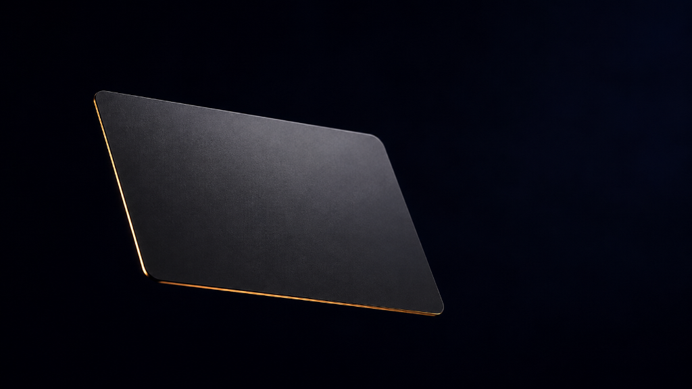
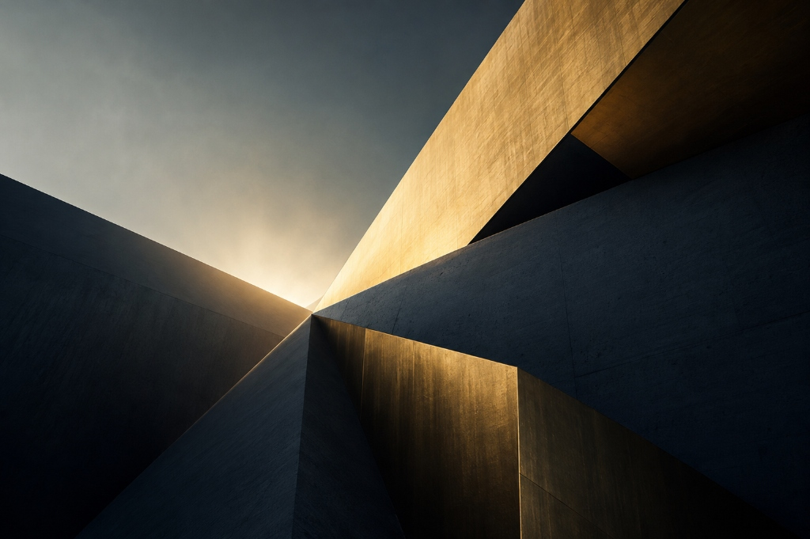

# Onyx Financial Landing Page

**Live Preview:** [https://Mudassar-Khann.github.io/onyx-3d-scroll-narrative/](https://Mudassar-Khann.github.io/onyx-3d-scroll-narrative/)

A high-performance, premium landing page designed for a modern fintech disruptor. This project eschews static imagery in favor of a continuous, hardware-accelerated 3D narrative that persists across the entire viewport as the user scrolls.

## Architecture & Technologies

The application is built on a modern, strictly typed React architecture, optimized for immediate time-to-interactive and 60fps physics rendering. 

- **Framework** -- React 18 with Vite for lightning-fast HMR and aggressive production code splitting.
- **Styling** -- Tailwind CSS v4 alongside native CSS for advanced compositing (`mix-blend-screen` and `backdrop-filter`).
- **3D Engine** -- Three.js managed via `@react-three/fiber` and `@react-three/drei`.
- **Physics & Scroll** -- GSAP (GreenSock Animation Platform) with ScrollTrigger for physics scrubbing, augmented by Framer Motion for highly optimized UI state transitions.

## The Global 3D Narrative

The defining feature of this architecture is the continuous 3D background layer. Rather than mounting and unmounting a 3D scene in the hero section, the `<Canvas>` is extracted to the root layer of the DOM (`fixed inset-0 z-0`). 

A single GSAP timeline maps to the entire document body scroll height, scrubbing the physical position, rotation, and convergence of 3D geometries in real-time.

1. **Act 1 (The Convergence)** -- Chaotic, exploded obsidian and gold geometries forcefully snap into a monolithic Onyx Card in true 3D space.
2. **Act 2 (The Refraction)** -- As the user scrolls into the Features section, the 3D card translates to the viewport's edge and rotates. The `MeshTransmissionMaterial` calculates real-time light refraction and chromatic aberration, bending the light of the background through the glass cover.
3. **Act 3 (The Core)** -- During the Pricing section, the card descends and tilts backward, revealing the physical, emissive gold core material beneath the obsidian.
4. **Act 4 (The Void)** -- The card drifts seamlessly into the dark background void as the user reaches the footer.

## Performance Optimizations

Rendering a fullscreen `MeshTransmissionMaterial` is computationally expensive. Rigorous optimizations have been applied to ensure the site runs flawlessly on all devices:

- **DPR Capping** -- Device Pixel Ratio is capped at `1.5x` within the Three.js Canvas to prevent GPU exhaustion on high-density Retina displays.
- **Material Raymarching Limits** -- Internal transmission resolution is strictly locked to `256` with disabled backside refraction to eliminate redundant calculations.
- **React Reconciliation Isolation** -- All heavily animated HTML elements utilize CSS `will-change: transform`. The UI state (e.g., FAQ accordions) is heavily memoized and isolated to prevent cascading React renders from interrupting the 3D paint loop.
- **Threaded Bundle Execution** -- Vite `manualChunks` configurations separate the payloads into `vendor-three`, `vendor-motion`, and `vendor-react` for parallel network resolution.

## Screenshots

### The Hero Sequence

### Feature Refraction

### Pricing & Materials

